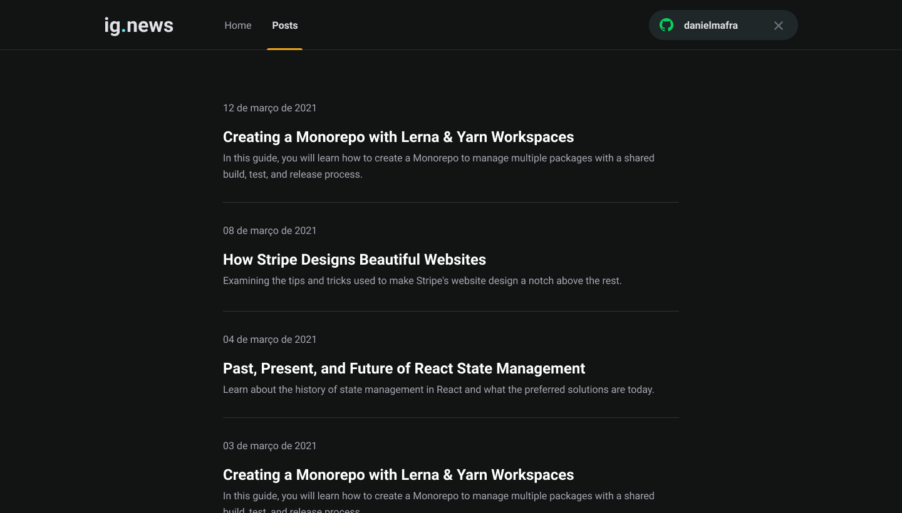
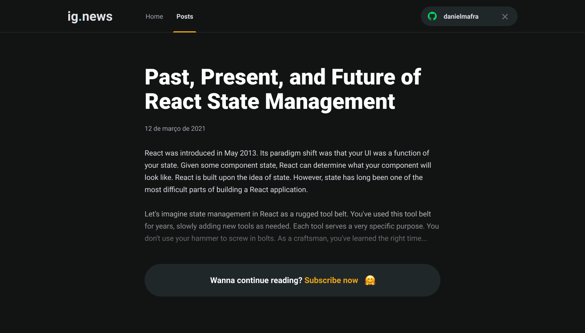
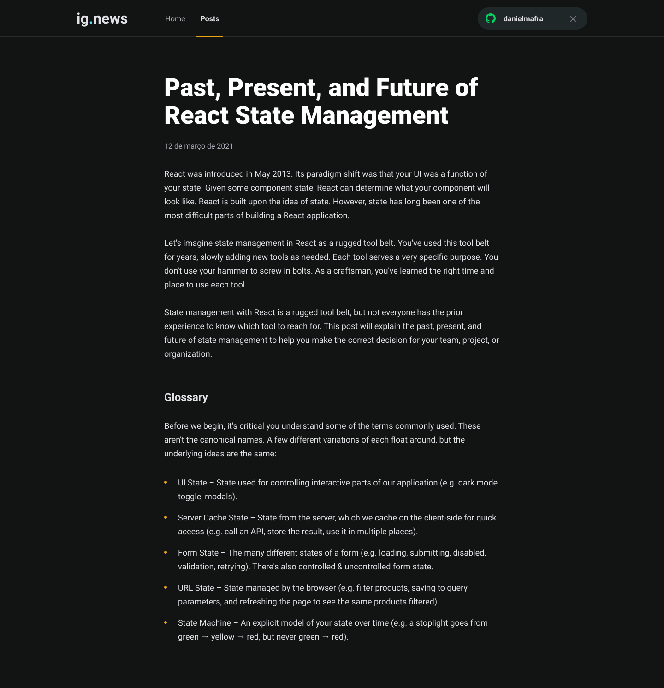

# Ignews - Blog with subscription content using NextJS, Stripe, FaunaDB and Prismic CMS.

This project was developed during the ReactJS track, available on Rocketseat's Ignite.

## Table of contents

- [Overview](#overview)
  - [The project](#the-project)
  - [Screenshot](#screenshot)
- [Development process](#development-process)
  - [Built with](#built-with)
- [Coded by](#coded-by)
- [How to run the project](#how-to-run-the-project)

## Overview

### The project

Users should be able to:

- Login with github
- Make subscription payment
- List blog posts
- Read blog post

### Screenshot

## Development process

### Built with

- NextJS
- ReactJS
- Prismic CMS
- FaunaDB
- Stripe
- Sass

## Coded by

- Website - [Daniel Mafra](https://danielmafra.github.io)
- LinkedIn - [@danielmafradev](https://linkedin.com/in/danielmafradev)
- Instagram - [@danielmafradev](https://instagram.com/danielmafradev)

## How to run the project

Clone the repository using "git clone". After that, go to the project folder and use the command "npm install" or "yarn install" to install the dependencies.

Configure authentication on Github and create an account / configure the project on the following services: Stripe, FaunaDB and Prismic CMS.

With the account created / project created in the services, rename the file .env.local.example to .env.local and add the access keys in the file.

Finally use the command "npm run dev" or "yarn dev" to start the project.
